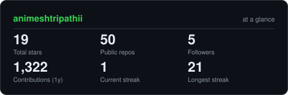
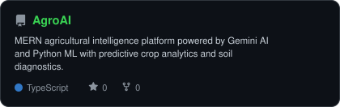
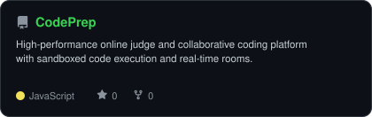
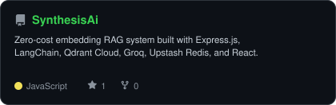
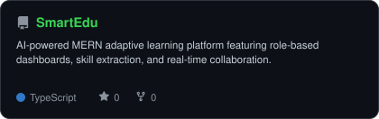

<div align="center">

<!-- PORTRAIT - generated by scripts/dotify.py from image.jpg.
     Colour mode, so one file serves both GitHub themes. Regenerate with:
       python scripts/dotify.py image.jpg -o assets/portrait \
         --cols 100 --equalize --detail 0.5 --color -->


<br>

<!-- NAME / TAGLINE - animated typing -->
<a href="https://github.com/animeshtripathii">
  
</a>

<br>

<!-- SOCIALS -->
<a href="https://linkedin.com/in/animesh003"></a>
<a href="mailto:tripathianimesh890@gmail.com"></a>
<a href="https://github.com/animeshtripathii"></a>


</div>

---

## `~/` whoami

```console
$ cat about.txt
```

Hi, I'm **Animesh Tripathi**. I build full-stack web applications, scalable developer platforms, and AI-powered systems that solve real-world problems.

- Currently building **[AgroAI](https://github.com/animeshtripathii/AgroAI)** and **[CodePrep](https://github.com/animeshtripathii/CodePrep)**
- Education: **B.Tech CSE** 🎓
- Learning **Advanced Web Technologies & Cloud Architecture**
- Fun fact: **I turn ideas into code and code into products! 💻✨**

<br>

<div align="center">

## `~/` toolbox


</div>

---

<div align="center">

## `~/` skill radar

<table>
<tr>
<td width="50%" align="center" valign="middle">

<!-- Self-rated radar - edit assets/skills.json, the workflow redraws it -->
<picture>
  <source media="(prefers-color-scheme: dark)"  srcset="assets/radar-dark.svg">
  <source media="(prefers-color-scheme: light)" srcset="assets/radar-light.svg">
  
</picture>

</td>
<td width="50%" align="center" valign="middle">

<!-- Live radar built from real language byte counts across your repos -->
<picture>
  <source media="(prefers-color-scheme: dark)"  srcset="assets/radar-langs-dark.svg">
  <source media="(prefers-color-scheme: light)" srcset="assets/radar-langs-light.svg">
  
</picture>

</td>
</tr>
</table>

</div>

---

<div align="center">

## `~/` contribution calendar

<!-- 3D isometric calendar, regenerated every 6h by .github/workflows/metrics.yml -->


<br><br>

<!-- Snake eats the contribution graph - .github/workflows/snake.yml -->
<picture>
  <source media="(prefers-color-scheme: dark)"  srcset="https://raw.githubusercontent.com/animeshtripathii/animeshtripathii/output/snake-dark.svg">
  <source media="(prefers-color-scheme: light)" srcset="https://raw.githubusercontent.com/animeshtripathii/animeshtripathii/output/snake.svg">
  
</picture>

</div>

---

<div align="center">

## `~/` the numbers

<!-- Generated by scripts/cards.py into this repo. Deliberately NOT
     github-readme-stats / streak-stats / github-profile-trophy: those are
     shared public instances that go down and take the whole section with them. -->
<picture>
  <source media="(prefers-color-scheme: dark)"  srcset="assets/card-stats-dark.svg">
  <source media="(prefers-color-scheme: light)" srcset="assets/card-stats-light.svg">
  
</picture>

<br>


<br><br>


</div>

---

<div align="center">

## `~/` selected work

<!-- Cards generated by scripts/cards.py from assets/projects.json.
     Stars, forks and language are pulled live from the API on every run. -->
<table>
<tr>
<td width="50%">
  <a href="https://github.com/animeshtripathii/AgroAI">
    <picture>
      <source media="(prefers-color-scheme: dark)"  srcset="assets/card-AgroAI-dark.svg">
      <source media="(prefers-color-scheme: light)" srcset="assets/card-AgroAI-light.svg">
      
    </picture>
  </a>
</td>
<td width="50%">
  <a href="https://github.com/animeshtripathii/CodePrep">
    <picture>
      <source media="(prefers-color-scheme: dark)"  srcset="assets/card-CodePrep-dark.svg">
      <source media="(prefers-color-scheme: light)" srcset="assets/card-CodePrep-light.svg">
      
    </picture>
  </a>
</td>
</tr>
<tr>
<td width="50%">
  <a href="https://github.com/animeshtripathii/SynthesisAi">
    <picture>
      <source media="(prefers-color-scheme: dark)"  srcset="assets/card-SynthesisAi-dark.svg">
      <source media="(prefers-color-scheme: light)" srcset="assets/card-SynthesisAi-light.svg">
      
    </picture>
  </a>
</td>
<td width="50%">
  <a href="https://github.com/animeshtripathii/SmartEdu">
    <picture>
      <source media="(prefers-color-scheme: dark)"  srcset="assets/card-SmartEdu-dark.svg">
      <source media="(prefers-color-scheme: light)" srcset="assets/card-SmartEdu-light.svg">
      
    </picture>
  </a>
</td>
</tr>
</table>

<sub>

| project | repository | stack |
|---|---|---|
| **[AgroAI](https://github.com/animeshtripathii/AgroAI)** | [github.com/animeshtripathii/AgroAI](https://github.com/animeshtripathii/AgroAI) | `TypeScript` `React` `Node.js` `Gemini AI` |
| **[CodePrep](https://github.com/animeshtripathii/CodePrep)** | [github.com/animeshtripathii/CodePrep](https://github.com/animeshtripathii/CodePrep) | `TypeScript` `React` `Node.js` `Docker` `Socket.io` |
| **[SynthesisAi](https://github.com/animeshtripathii/SynthesisAi)** | [github.com/animeshtripathii/SynthesisAi](https://github.com/animeshtripathii/SynthesisAi) | `JavaScript` `LangChain` `Qdrant` `Groq` `React` |
| **[SmartEdu](https://github.com/animeshtripathii/SmartEdu)** | [github.com/animeshtripathii/SmartEdu](https://github.com/animeshtripathii/SmartEdu) | `TypeScript` `React` `Node.js` `MongoDB` `AI` |

</sub>

</div>

---

<div align="center">

<sub>`01110100 01101000 01100001 01101110 01101011 01110011 00100000 01100110 01101111 01110010 00100000 01110011 01100011 01110010 01101111 01101100 01101100 01101001 01101110 01100111`</sub>

</div>
